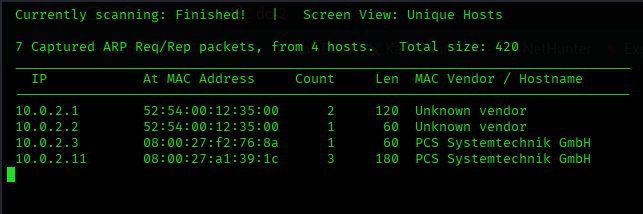

## ORGANIC MACHINE LINK 
[DC2](https://download.vulnhub.com/dc/DC-2.zip)

#### DIFFICULTY: EASY

 

## OBJECTIVE

_*The objective of this machine is to gain root access by exploiting vulnerabilities and escalating privileges.*_

 

## Skills Practiced   

- Network Discovery
- Enumeration
- WordPress Enumeration
- Password Attacks
- SSH Access
- Restricted Bash Escape
- Linux Privilege Escalation
- GTFOBins

## Tools Used

- Netdiscover
- Nmap
- CeWL
- WPScan
- SSH
- Vim
- GTFOBins

## Reconnaissance

### Finding the Target IP

> 
